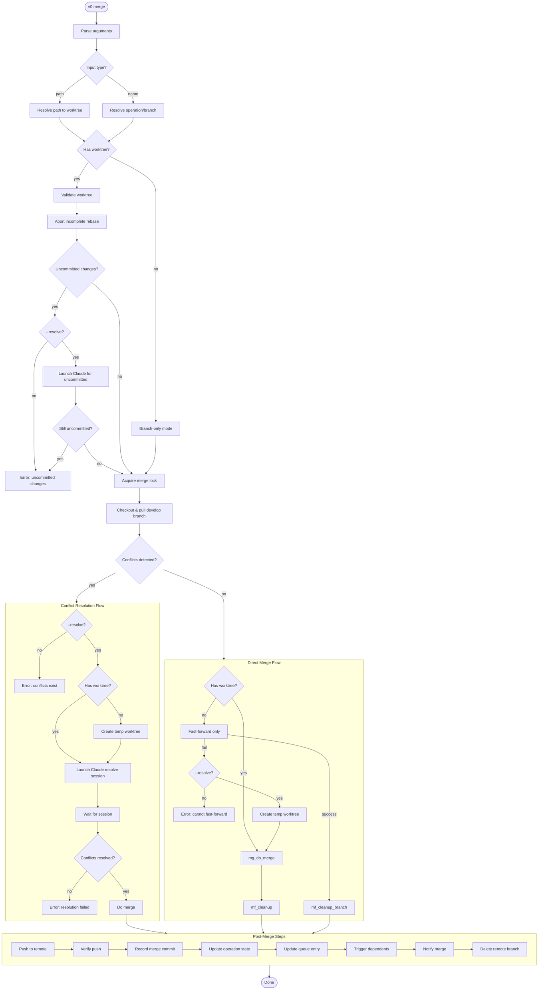
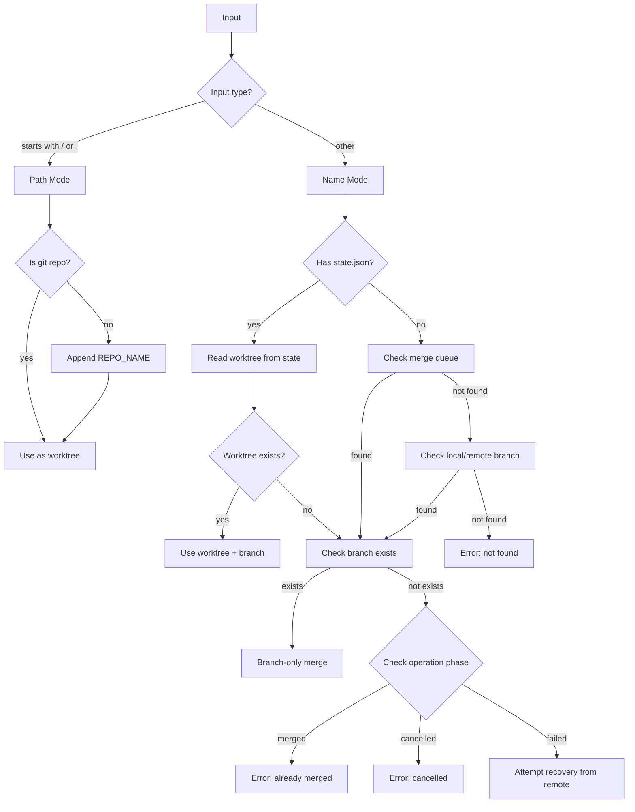
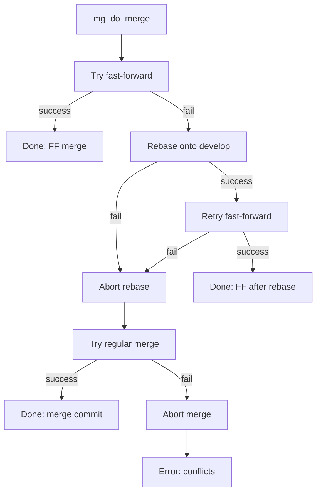
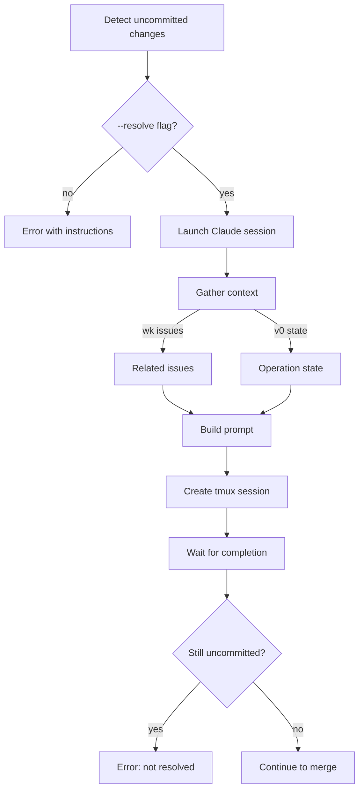
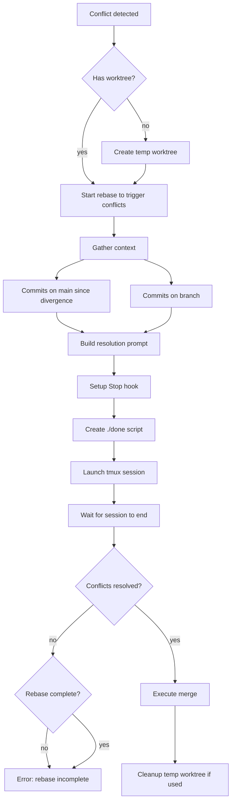

# v0-merge

**Purpose:** Merge a worktree branch to main.

## Usage

```bash
v0 merge <operation>                 # Merge by operation name
v0 merge <operation> --resolve       # Auto-resolve conflicts
v0 merge /path/to/worktree           # Merge by worktree path
v0 merge fix/PROJ-abc123             # Merge by branch name
```

## Control Flow Overview



## Input Resolution

The merge command accepts three types of input:



## Merge Strategy



## Conflict Detection

Conflicts are detected **before** attempting the actual merge using `git merge-tree`:

```bash
git merge-tree --write-tree HEAD <branch>
```

This allows the command to:
1. Fail fast with a helpful message when `--resolve` is not provided
2. Set up the resolution environment before triggering conflicts

## Uncommitted Changes Handling

When a worktree has uncommitted changes:



## Conflict Resolution Flow



## Post-Merge Operations

After a successful merge, these steps execute in order:

| Step | Function | Description |
|------|----------|-------------|
| 1 | `mg_push_and_verify` | Push to remote, verify commit landed |
| 2 | `mg_record_merge_commit` | Store merge commit hash in operation state |
| 3 | `mg_update_operation_state` | Set `phase=merged`, `merged_at` |
| 4 | `mg_update_queue_entry` | Mark queue entry as `completed` |
| 5 | `mg_trigger_dependents` | Resume operations blocked by this one |
| 6 | `mg_notify_merge` | Send desktop notification |
| 7 | `mg_delete_remote_branch` | Clean up remote branch |

## Error Handling

| Error | Condition | Resolution |
|-------|-----------|------------|
| Lock held | Another merge in progress | Wait or remove stale lock |
| Uncommitted changes | Worktree is dirty | Use `--resolve` or commit manually |
| Conflicts | Merge would conflict | Use `--resolve` for auto-resolution |
| Push failed | Remote rejected push | Check permissions, fetch and retry |
| Verify failed | Commit not on main | Investigation required |
| Already merged | Operation phase is `merged` | No action needed |
| Branch missing | No local or remote branch | Fetch or recreate |

## Locking

The merge command uses a file-based lock at `${BUILD_DIR}/.merge.lock` to prevent concurrent merges:

- Lock contains: `<branch> (pid <pid>)`
- Released automatically via EXIT trap
- Stale locks can be manually removed

## Integration with Merge Queue

When called by `v0 mergeq`:
- Environment variable `V0_MERGEQ_CALLER` is set
- Queue entry updates are skipped (mergeq handles them)
- Same merge logic applies
