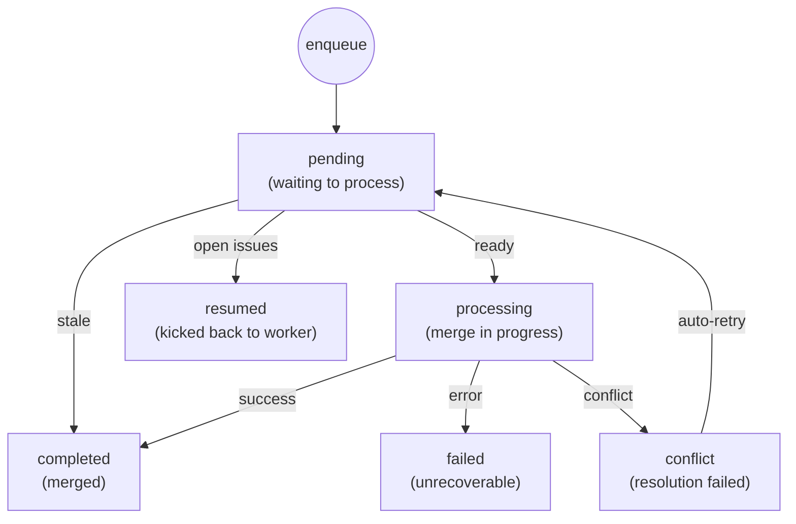

# Merge Queue State Machine

This document describes the state machine used by the v0 merge queue.

## Overview

The merge queue serializes merges from multiple concurrent operations into the main branch. Each queue entry has a lifecycle managed by a state machine stored in `${BUILD_DIR}/mergeq/queue.json`.

## State Diagram



## State Definitions

### Core States

| State | Description |
|-------|-------------|
| `pending` | Waiting to be processed. Entry is in queue but not yet picked up by daemon. |
| `processing` | Currently being merged. Daemon has claimed this entry. |
| `completed` | Successfully merged to main branch, or cleaned as stale. Terminal state. |

### Error States

| State | Description |
|-------|-------------|
| `failed` | Merge failed due to fetch, push, or checkout error. Requires investigation. |
| `conflict` | Merge conflict detected and automatic resolution failed. Will auto-retry once. |
| `resumed` | Entry removed from queue; operation resumed to complete outstanding work. |

## State Transitions

### Enqueue → Pending

Operations are added to the queue via:
- `v0 mergeq --add <operation>` - Manual addition
- Automatic queuing when operation sets `merge_queued=true`

Queue entries include:
- `operation` - Name or branch being merged
- `priority` - Lower numbers processed first (default: 0)
- `merge_type` - Either `operation` (has state.json) or `branch` (bare branch)
- `issue_id` - Optional associated issue to close on success

### Pending → Processing

The daemon polls every 30 seconds and picks the highest-priority ready entry:
1. Checks `is_merge_ready()` - verifies operation is complete
2. Checks `is_stale()` - cleans entries for already-merged operations
3. Marks entry as `processing`
4. Calls `process_merge()`

### Processing → Completed

On successful merge:
1. Merge or rebase onto main branch
2. Push to remote
3. Delete feature branch
4. Update operation state: `phase=merged`, `merged_at=<timestamp>`
5. Archive plan file
6. Trigger dependent operations

### Processing → Failed

Merge fails for infrastructure reasons:
- Checkout failed (branch locked)
- Fetch failed (network/permission)
- Push failed (rejected, permission)

Failed entries require manual investigation.

### Processing → Conflict

Merge has conflicts:
1. Daemon launches Claude in tmux to attempt resolution
2. If resolution succeeds → `completed`
3. If resolution fails or times out → `conflict`

### Conflict → Pending (Auto-Retry)

On next poll cycle:
1. Daemon checks `conflict_retried` flag
2. If not retried: marks `conflict_retried=true`, resets to `pending`
3. If already retried: skips (needs manual intervention)

### Pending → Resumed

When operation has open issues after queuing:
1. Daemon detects incomplete work via `open_issues` check
2. Marks entry as `resumed`
3. Restarts worker with `v0 feature --resume queued`
4. Worker completes issues and re-queues

### Pending → Completed (Stale Cleanup)

Stale entries are auto-cleaned when:
- Operation's `merged_at` is set (already merged)
- State was recreated after queue entry (operation restarted)
- Branch no longer exists on remote

## Queue File Schema

```json
{
  "version": 1,
  "entries": [
    {
      "operation": "auth",
      "worktree": "/path/to/worktree",
      "priority": 0,
      "enqueued_at": "2026-01-19T00:00:00Z",
      "status": "pending",
      "merge_type": "operation",
      "issue_id": "proj-abc123",
      "updated_at": "2026-01-19T00:05:00Z"
    }
  ]
}
```

| Field | Description |
|-------|-------------|
| `operation` | Operation name or branch name (e.g., `auth` or `fix/bug-123`) |
| `worktree` | Path to worktree (operations only) |
| `priority` | Processing order (lower = higher priority) |
| `enqueued_at` | ISO 8601 timestamp when added |
| `status` | Current state |
| `merge_type` | `operation` (has state.json) or `branch` (bare branch merge) |
| `issue_id` | Optional issue to mark done on success |
| `updated_at` | ISO 8601 timestamp of last status change |

## Merge Types

### Operation Merges

Operations created by `v0 feature`, `v0 fix`, etc.:
- Have a `state.json` file tracking operation state
- Require `merge_queued=true` and `phase=completed` (or later)
- All associated issues must be done
- Worktree must exist

### Branch Merges

Bare branches pushed directly (e.g., `fix/proj-abc1`, `chore/proj-xyz9`):
- No state file required
- Branch must exist on remote
- Used by fix and chore workers via `./fixed`

## Daemon Behavior

The daemon (`v0 mergeq --watch`) runs continuously:

```
┌─────────────────────────────────────────────────┐
│                 Poll Cycle (30s)                │
├─────────────────────────────────────────────────┤
│ 1. Check conflict entries for auto-retry        │
│ 2. Get all pending entries (priority order)     │
│ 3. For each pending entry:                      │
│    - Clean if stale                             │
│    - Skip if not ready (log reason)             │
│    - Auto-resume if has open issues             │
│    - Process first ready entry                  │
│ 4. Sleep and repeat                             │
└─────────────────────────────────────────────────┘
```

## Concurrency and Locking

The queue uses file-based locking (`${BUILD_DIR}/mergeq/.queue.lock`):
- Lock acquired before any queue modification
- Lock released immediately after update
- Stale lock detection (dead PID)
- Retry with exponential backoff on contention

Only one merge processes at a time to prevent race conditions on the main branch.

## Interaction with Operations

When an operation completes successfully:
1. Operation state updated first (`phase=merged`, `merged_at`)
2. Queue entry marked `completed` last
3. Dependent operations unblocked and resumed

This ordering prevents race conditions where a dependent operation sees `completed` in the queue before the operation state reflects the merge.
