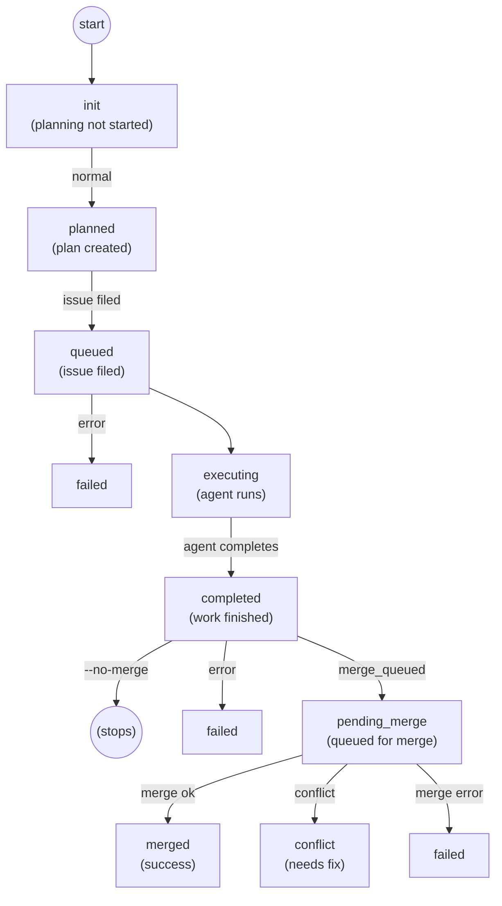

# Operations State Machine

This document describes the core state machine used by v0 operations (features, fixes, and chores).

## Overview

Operations are work units tracked by v0. Each operation has a lifecycle managed by a state machine stored in `${BUILD_DIR}/operations/${name}/state.json`.

## State Diagram



## State Definitions

### Core States

| State | Description |
|-------|-------------|
| `init` | Initial state. Planning has not started yet. |
| `planned` | Plan file created at `plans/<name>.md`. Ready for issue filing. |
| `queued` | Feature issue filed from plan. Ready for execution. |
| `executing` | Claude agent is running in a tmux session. |
| `completed` | Agent finished work. May be pending merge. |
| `pending_merge` | Added to merge queue, waiting to be merged. |
| `merged` | Successfully merged to main branch. Terminal state. |

### Error States

| State | Description |
|-------|-------------|
| `failed` | Error during any phase. Can be resumed with `--resume`. |
| `conflict` | Merge conflict detected. Needs manual resolution or retry. |
| `interrupted` | User interrupted the operation. Can be resumed. |
| `cancelled` | Operation cancelled by user via `v0 cancel`. |

## State Transitions

### Planning Phase (`init` → `planned`)

- Claude agent creates an implementation plan
- Plan saved to `plans/<name>.md`
- Plan auto-committed to git

### Issue Filing Phase (`planned` → `queued`)

- Single feature issue created using `wk new feature`
- Issue labeled with `plan:<name>`
- Issue description contains the full plan contents

### Execution Phase (`queued` → `executing` → `completed`)

- Claude agent launched in tmux session
- Works through issues sequentially
- Marks issues as done via `wk done`
- On completion, transitions to `completed`

### Merge Phase (`completed` → `pending_merge` → `merged`)

- If `merge_queued=true`, operation added to merge queue
- Merge queue daemon processes merges sequentially
- On conflict, attempts automatic resolution with Claude
- On success, branch merged to main and deleted

## Dependency Tracking (v2+)

Starting with schema v2, operation dependencies are tracked exclusively
in wok using `blocked-by` relationships:

```bash
# Add dependency when creating operation
v0 build api "Build API" --after auth
# Multiple dependencies supported:
v0 build api "Build API" --after auth,config
v0 build api "Build API" --after auth --after config

# Check if operation is blocked (via wok)
wk show <epic_id> -o json | jq '.blockers'

# Operations are unblocked when blockers reach done/closed status
wk ready --label plan:<name>  # Shows if unblocked
```

The `after`, `blocked_phase`, and `eager` fields have been removed from
state.json. Migration from v1 automatically adds wok dependencies.

### Blocking Behavior

Operations can depend on other operations using the `--after` flag:

```bash
v0 feature api "Build API" --after auth
v0 feature api "Build API" --after auth,config  # Multiple deps
```

When an operation has unresolved blockers:
- The worker checks wok before execution
- If blocked, worker pauses and logs the blocker
- Operation proceeds when all blockers reach `done` or `closed` status in wok

### Unblocking Flow

When a blocker operation merges:
1. `sm_transition_to_merged` marks the operation's wok epic as `done`
2. This unblocks dependent operations that were waiting on this blocker
3. `sm_trigger_dependents` logs the unblock event for visibility
4. Dependent workers resume on their next poll/resume

Safety net: If the wok epic wasn't marked done (e.g., due to a bug), `v0 resume`
repairs stale blockers by checking if the blocker operation is merged but its
wok issue is still open, and marks it done before checking blocking status.

## Hold Mechanism

Operations can be put on hold to prevent phase transitions:

```bash
v0 hold <name>      # Put on hold
v0 resume <name>    # Release hold
```

When held:
- `state.held = true`
- Phase transitions are blocked
- Agent exits gracefully after current work

## State File Schema (v2)

```json
{
  "name": "auth",
  "machine": "hostname",
  "prompt": "Add JWT authentication",
  "phase": "executing",
  "created_at": "2026-01-19T00:00:00Z",
  "labels": [],
  "plan_file": "plans/auth.md",
  "epic_id": "proj-abc123",
  "tmux_session": "v0-proj-auth-feature",
  "worktree": "/path/to/worktree/repo",
  "current_issue": "proj-def456",
  "completed": ["proj-ghi789"],
  "merge_queued": true,
  "merge_status": null,
  "merged_at": null,
  "merge_error": null,
  "held": false,
  "held_at": null,
  "worker_pid": 12345,
  "worker_log": "/path/to/logs/worker.log",
  "worker_started_at": "2026-01-19T00:00:00Z",
  "_schema_version": 2,
  "_migrated_at": "2026-01-19T00:00:00Z"
}
```

Note: The `after`, `blocked_phase`, `eager`, and `safe` fields were removed in v2.
Dependencies are tracked via wok `blocked-by` relationships instead.

## Merge Queue States

The merge queue has its own state machine for entries:

```
pending → processing → completed
                    ↘ failed
                    ↘ conflict
```

| State | Description |
|-------|-------------|
| `pending` | Waiting to be processed |
| `processing` | Currently being merged |
| `completed` | Successfully merged |
| `failed` | Merge failed (fetch, push, etc.) |
| `conflict` | Merge conflict, resolution failed |

## Human Handoff Flow

For fix workers, there's a special flow when the agent cannot complete a fix:

### Note-Without-Fix Scenario

When a fix worker:
1. Starts working on a bug (`wk start`, `./new-branch`)
2. Documents why they can't fix it (`wk note <id> "reason"`)
3. Attempts to exit without committing a fix

The system detects this pattern and:
1. Reassigns the bug to `worker:human`
2. Blocks the stop hook with a helpful message
3. Bug remains in `in_progress` status for human review

### Human Resolution Options

When a bug is assigned to `worker:human`:

| Action | Command | When to Use |
|--------|---------|-------------|
| View details | `wk show <id>` | See the agent's notes explaining the issue |
| Fix manually | Fix code, then `wk done <id>` | When you can resolve the bug yourself |
| Close as invalid | `wk close <id> --reason="..."` | When bug is not reproducible or invalid |
| Reassign to worker | `wk edit <id> assignee worker:fix && wk reopen <id>` | When issue was transient |

### Assignee Semantics

| Assignee | Meaning |
|----------|---------|
| `worker:fix` | Assigned to fix worker for automated processing |
| `worker:chore` | Assigned to chore worker |
| `worker:mergeq` | Assigned to merge queue (pending merge) |
| `worker:human` | Requires human attention - agent documented why they couldn't complete |
| `none` | Unassigned, available for pickup |

## Recovery from Error States

When an operation is in `failed`, `interrupted`, or `cancelled` state:

1. Resume determines last good state from existing data:
   - If `epic_id` exists → resume from `queued`
   - If `plan_file` exists → resume from `planned`
   - Otherwise → restart from `init`
2. Error state cleared
3. Operation continues from determined phase

```bash
v0 feature <name> --resume           # Resume from current phase
v0 feature <name> --resume init      # Force restart from planning
v0 feature <name> --resume queued    # Force restart from execution
```
