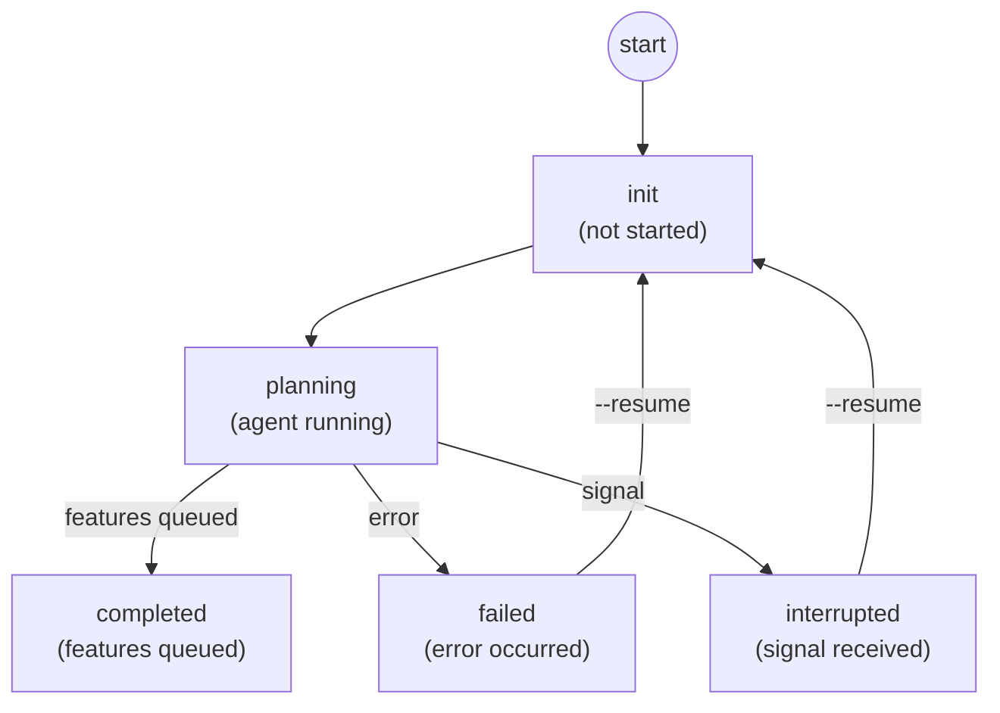

# Roadmap State Machine

This document describes the state machine used by v0 roadmap orchestration.

## Overview

The roadmap system orchestrates autonomous work using a high-level roadmap description. A Claude agent decomposes the roadmap into features with dependencies and queues them for execution. Each roadmap has a lifecycle managed by a state machine stored in `${BUILD_DIR}/roadmaps/${name}/state.json`.

## State Diagram



## State Definitions

### Core States

| State | Description |
|-------|-------------|
| `init` | Initial state. Roadmap created but orchestration has not started. |
| `planning` | Claude agent is running in tmux session, decomposing roadmap into features. |
| `completed` | Roadmap orchestration finished. Features queued for independent execution. |

### Error States

| State | Description |
|-------|-------------|
| `failed` | Worker encountered an error (worktree creation, tmux, etc.). Can be resumed. |
| `interrupted` | Worker was terminated by signal (SIGTERM/SIGINT). Can be resumed. |

## State Transitions

### Initialization Phase (`init` → `planning`)

When starting a new roadmap:
1. State directory created at `${BUILD_DIR}/roadmaps/${name}/`
2. Optional idea issue created for tracking (`wk new idea`)
3. Worker process spawned (background or foreground)
4. Worktree created on `roadmap/${name}` branch
5. CLAUDE.md generated from `claude.roadmap.m4` template
6. ROADMAP.md instructions copied to worktree
7. Claude agent launched in tmux session

### Planning Phase (`planning` → `completed`)

The Claude agent:
1. Explores the codebase to understand structure
2. Creates a roadmap outline with epics and milestones
3. Queues features using `v0 feature --after --label roadmap:${name}`
4. Commits any roadmap documentation to the branch
5. Calls `./done` script to signal completion

When the agent exits and features are detected (via `wk list --label roadmap:${name}`):
- Phase transitions to `completed`
- Feature IDs stored in `features_queued` array
- `completed_at` timestamp recorded

## Error Recovery

### From `failed` State

1. Run `v0 roadmap ${name} --resume`
2. State reset to `init`
3. Worker restarts orchestration from beginning

### From `interrupted` State

1. Run `v0 roadmap ${name} --resume`
2. State reset to `init`
3. Worker restarts orchestration from beginning

Note: Unlike operations, roadmaps restart from `init` on recovery rather than resuming mid-phase.

## State File Schema

```json
{
  "name": "rewrite",
  "type": "roadmap",
  "machine": "hostname",
  "roadmap_description": "Rewrite the entire frontend in React",
  "phase": "completed",
  "idea_id": "proj-abc123",
  "epics": [],
  "milestones": [],
  "features_queued": ["proj-def456", "proj-ghi789"],
  "created_at": "2026-01-19T00:00:00Z",
  "completed_at": "2026-01-19T01:30:00Z",
  "planning_session": "v0-proj-rewrite-roadmap",
  "worktree": "/path/to/worktree/repo",
  "worker_pid": null,
  "worker_log": "/path/to/roadmaps/rewrite/logs/worker.log"
}
```

| Field | Description |
|-------|-------------|
| `name` | Roadmap identifier |
| `type` | Always `"roadmap"` |
| `machine` | Hostname where roadmap was created |
| `roadmap_description` | High-level description of the roadmap |
| `phase` | Current state |
| `idea_id` | Optional idea issue tracking the roadmap |
| `epics` | Reserved for future use (epic tracking) |
| `milestones` | Reserved for future use (milestone tracking) |
| `features_queued` | Issue IDs of features queued by the agent |
| `created_at` | ISO 8601 timestamp when roadmap was created |
| `completed_at` | ISO 8601 timestamp when orchestration completed |
| `planning_session` | Tmux session name for the planning agent |
| `worktree` | Path to worktree where agent runs |
| `worker_pid` | PID of background worker process (null when not running) |
| `worker_log` | Path to worker log file |

## Stop Hook Behavior

The `stop-roadmap.sh` hook prevents premature exit:

| Condition | Decision | Reason |
|-----------|----------|--------|
| No roadmap context | Approve | Not a v0 roadmap session |
| System stop (auth, credits) | Approve | Infrastructure issue |
| Stop hook already active | Approve | Prevent infinite loops |
| No features queued | Block | Orchestration incomplete |
| Uncommitted changes | Block | Must commit before exit |
| Features queued, clean worktree | Approve | Orchestration complete |

Environment variables used by stop hook:
- `V0_ROADMAP_NAME`: Roadmap identifier
- `V0_WORKTREE`: Path to worktree for uncommitted changes check

## Worker Lifecycle

The background worker (`v0-roadmap-worker`) manages the state machine:

```
┌─────────────────────────────────────────────────┐
│              Worker Lifecycle                    │
├─────────────────────────────────────────────────┤
│ 1. Load state from state.json                   │
│ 2. Check current phase                          │
│ 3. If init/planning: run orchestration          │
│ 4. If completed: already done, exit             │
│ 5. If failed/interrupted: reset to init, retry  │
│ 6. Update worker_pid on exit                    │
└─────────────────────────────────────────────────┘
```

## Status Display

`v0 status` shows roadmaps only during active phases:

| Phase | Shown in Status | Indicator |
|-------|-----------------|-----------|
| `init` | Yes | (dim) |
| `planning` | Yes | (active) if tmux running, (bg-worker) if worker running |
| `completed` | No | - |
| `failed` | No | Use `v0 roadmap <name> --resume` to recover |
| `interrupted` | No | Use `v0 roadmap <name> --resume` to recover |

## Relationship to Operations

Roadmaps create operations (features) that follow the [operations state machine](../operations/state.md):

1. Roadmap agent calls `v0 feature --after --label roadmap:${name}`
2. Each feature becomes an independent operation
3. Features are chained with `--after` for sequential execution
4. The roadmap tracks feature IDs but doesn't manage their execution

This separation allows:
- Roadmap to complete once features are queued
- Features to execute independently via their own state machines
- Failures in one feature to not block the entire roadmap
